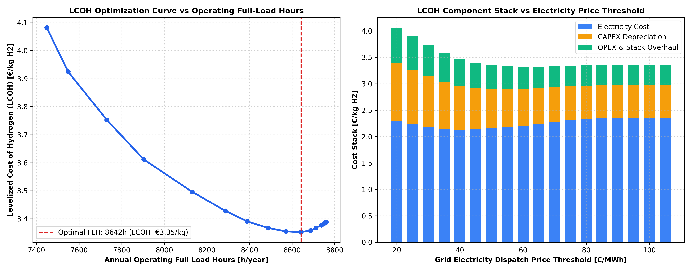

# 🧪 Green Hydrogen & PEM Electrolyzer LCOH Dispatch Optimization (Germany)

A techno-economic dispatch optimization and financial life-cycle model calculating the **Levelized Cost of Hydrogen (LCOH in €/kg H2)** for a **20 MW PEM Electrolyzer** co-located with a **50 MW hybrid renewable plant (30 MW Wind + 20 MW Solar PV)** and a dynamic grid connection in Germany.

---

## 📌 Engineering Architecture & Methodology

* **Electrolyzer Technology:** 20 MW Proton Exchange Membrane (PEM), 52.5 kWh/kg specific power consumption, 10% minimum load turndown.
* **Hybrid Co-location:** 30 MW Onshore Wind + 20 MW Solar PV with behind-the-meter PPA (€45/MWh).
* **Grid Dispatch Strategy:** Threshold-based dynamic dispatch importing power from the Day-Ahead spot market only when wholesale prices fall below the calculated economic break-even threshold.
* **Financial Life-Cycle (DCF):** 20-Year economic life, 7.0% WACC, CAPEX (€1,100/kW), 60,000-hour PEM stack overhaul cycles (€300/kW), and water demineralization costs.

---

## 📊 Optimal Techno-Economic Results

| Metric | Optimal Value | Context / Benchmark |
| :--- | :---: | :--- |
| **Minimum LCOH** | **€3.35 / kg H2** | Fully delivered levelized production cost |
| **Optimal Electricity Threshold** | **€65 / MWh** | Dispatches only when grid power $\le$ €65/MWh |
| **Annual Operating Hours** | **8,642 Hours/year** | 98.7% Capacity Factor |
| **Annual H2 Output** | **3,099.3 Tonnes / year** | Clean zero-emission industrial feedstock |
| **Electricity Share in LCOH** | **67.0% (€2.25/kg)** | Primary cost driver of clean hydrogen |
| **CAPEX Amortization Share** | **20.0% (€0.67/kg)** | Capital recovery across 20-year lifetime |
| **OPEX & Stack Overhaul** | **12.1% (€0.41/kg)** | Maintenance and 60k-hour cell replacements |

---

## 📈 Optimization Breakdown

---

## 🛠️ Tech Stack
* **Language:** Python 3.10+
* **Data & Numerical Analytics:** `pandas`, `numpy`
* **Visualization:** `matplotlib`
